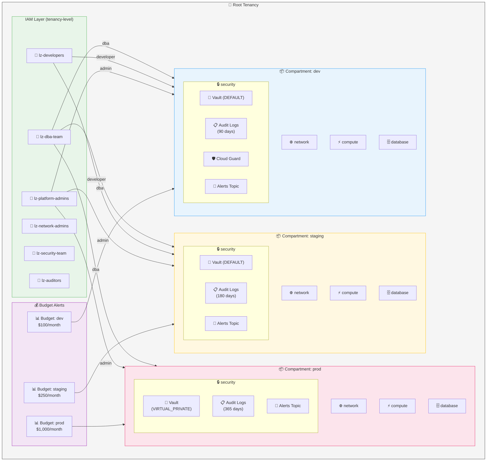
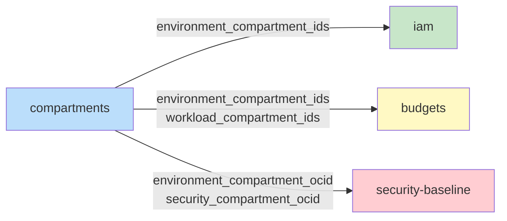
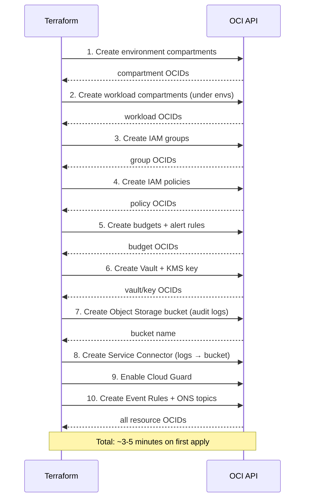

# OCI Landing Zone — Architecture Diagram

This diagram can be rendered with any Mermaid-compatible viewer (GitHub, GitLab, Notion, VS Code with Mermaid extension).

## Module Dependency Graph

## Deployment Order

